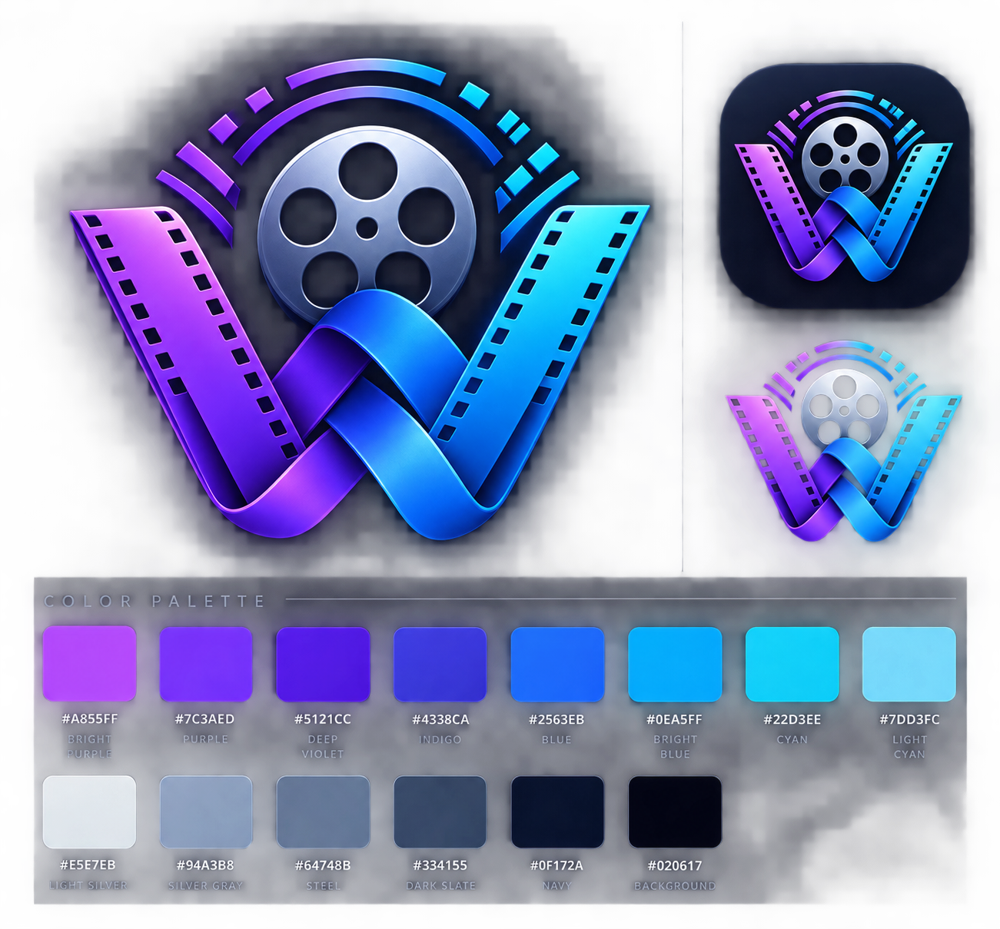

# WatchWeaver

[](https://codecov.io/gh/thef4tdaddy/watchweaver)

**Self-hosted watch history, ratings, and reviews across Trakt, Letterboxd, Serializd, and Discord.**



> [!IMPORTANT]
> WatchWeaver is currently in early development. The architecture and feature set may change significantly before the first release.

## What is WatchWeaver?

WatchWeaver is a self-hosted media tracking service that receives watch history from Trakt or Jellyfin and routes that activity into useful workflows for rating, reviewing, and synchronizing movies and television.

The goal is to let your media server or scrobbler keep tracking automatically while WatchWeaver handles what comes afterward.

## Planned features

- Import movie and TV watch activity from Trakt
- Preserve episode-level watch history locally
- Announce rating/review tasks through optional Discord notifications
- Write supported ratings back to Trakt
- Apply smart TV rating rules:
  - Prompt for completed seasons while bingeing older shows
  - Prompt for individual episodes when caught up with actively airing shows
- Generate Letterboxd-compatible CSV exports for movies, including supported watched dates, ratings, reviews, and rewatches
- Track TV activity since the last Serializd Trakt import and remind you when it is time to sync again
- Provide a self-hosted web dashboard for history, rating queues, exports, sync status, and configuration
- Run as a Dockerized service suitable for a NAS or home server

## Intended flow

```text
Jellyfin / Plex / other scrobblers
               |
               v
             Trakt
               |
               v
          WatchWeaver
          /    |     \
         v     v      v
    Discord Letterboxd Serializd
```

Trakt is intended to provide automated viewing activity. WatchWeaver maintains its own application state and uses supported integration paths for downstream services rather than requiring those services to be the source of truth.

## Jellyfin plugin

The official [WatchWeaver Jellyfin plugin](https://github.com/thef4tdaddy/watchweaver-jellyfin) sends completed movie and episode activity directly from Jellyfin to WatchWeaver. It is distributed separately because it runs inside Jellyfin and follows Jellyfin's plugin compatibility requirements.

Add this repository URL in **Jellyfin Dashboard → Plugins → Repositories**:

```text
https://thef4tdaddy.github.io/watchweaver-jellyfin/manifest.json
```

Installation, compatibility, configuration, and troubleshooting instructions are maintained in the [plugin repository](https://github.com/thef4tdaddy/watchweaver-jellyfin#readme). Keep WatchWeaver and the plugin on compatible `0.x` release lines. Both services are intended for trusted LAN/VPN use and should not be exposed directly to the public internet.

WatchWeaver supports two Jellyfin directions from **Settings → Jellyfin Plugin**:

- **WatchWeaver → Jellyfin** is recommended for seedboxes and multiple servers. WatchWeaver connects outward to each named Jellyfin instance, so the private WatchWeaver port does not need to be reachable by the seedbox.
- **Jellyfin → WatchWeaver** lets the plugin push to one WatchWeaver instance and is simplest when both systems can already reach each other on a trusted LAN/VPN.

Both directions may be enabled together. History identifies the source and Jellyfin instance so you can tell direct Jellyfin activity from activity imported through Trakt.

## Project principles

- **Self-hosted first.** Your WatchWeaver instance and its database belong on infrastructure you control.
- **No unofficial integration required for the core workflow.** The project should remain useful even when a destination does not provide a public write API.
- **Human-friendly notifications.** Tracking every episode does not mean sending a notification for every episode.
- **Portable data.** Watch history, ratings, reviews, and export state should not exist only inside one third-party service.
- **Privacy by default.** Credentials, databases, watch history, generated exports, logs, and instance-specific configuration must never be required in the repository.

## Install with Docker Compose

> [!WARNING]
> WatchWeaver has no application login. It is supported only on a trusted LAN, through a private VPN, or behind an authenticated reverse proxy. Direct public-internet exposure is unsupported and may expose private viewing data and administrative controls.

```bash
git clone https://github.com/thef4tdaddy/watchweaver.git
cd watchweaver
docker compose up -d
```

Open `http://localhost:8080` and follow the first-run wizard to enter Trakt credentials, authorize the account, and optionally configure Discord. Creating a new personal API application currently requires [Trakt VIP](https://trakt.tv/vip); an existing valid Trakt application also works. This is a Trakt policy, not a WatchWeaver subscription. The wizard includes the exact application values and device-authorization steps. No `.env` file is required for normal setup. Compose stores the database, generated credential-encryption key, backups, and retained exports in the named `watchweaver-data` volume. Pin `ghcr.io/thef4tdaddy/watchweaver:<version>` in `compose.yaml` for predictable production upgrades.

The Settings page can run Trakt synchronization immediately, retry a failed cycle, and show its last result and next scheduled run. Device authorization is checked automatically while the Trakt code is displayed.

The Status page summarizes integrations, local storage, and backup freshness in
plain language, provides the relevant recovery action, and can download a
redacted diagnostics report for troubleshooting.

Published container channels are `beta` for prerelease testing and `latest` for stable releases. Immutable tags such as `0.1.0-beta.1` or `0.1.0` are recommended when you want upgrades to be explicit.

### Add WatchWeaver to Homarr

Create a custom app in Homarr with:

- **Name:** `WatchWeaver`
- **App URL:** the private URL you use to open WatchWeaver, for example `http://192.168.1.20:18473`
- **Ping URL:** the same base URL plus `/readyz`, for example `http://192.168.1.20:18473/readyz`

Use the WatchWeaver icon from `web/public/brand/watchweaver-icon.png` or the raw GitHub copy. Keep the app tile and ping URL limited to the same LAN/VPN access boundary as WatchWeaver.

### Back up and restore

Create a consistent live SQLite backup without stopping the service:

```bash
docker compose exec watchweaver watchweaver backup
```

Backups are written beneath `/data/backups`; the companion `.key` file is required to decrypt saved integration credentials. To restore, first stop WatchWeaver, copy a known-good backup over `/data/watchweaver.db`, restore its companion key as `/data/.watchweaver.key`, remove any old `watchweaver.db-wal` and `watchweaver.db-shm` files, and restart the same or a compatible newer image. Never replace the database while WatchWeaver is running.

### Upgrade

Create a backup, update the pinned image version, then run:

```bash
docker compose pull
docker compose up -d
```

The same `/data` volume is reused and pending migrations run before readiness succeeds. Downgrades are not guaranteed; restore the pre-upgrade backup with the compatible version instead.

### Troubleshooting

Start on **Status**. It distinguishes a disconnected integration from a reminder-only destination and offers the relevant retry or setup action. For Jellyfin, **Settings → Jellyfin Plugin** shows each named connection, direction, latest attempt/event, retry time, safe error code, and event count.

If that is not enough, use **Status → Download diagnostics** and attach the resulting redacted report to a private support conversation or GitHub issue. It excludes credentials, URLs, user identity, titles, reviews, and raw event payloads. Container logs are also available with `docker compose logs --tail=200 watchweaver`; inspect the safe error code rather than posting an entire unreviewed log publicly.

When an upgrade fails readiness, keep the failed container and `/data` volume intact, inspect its logs, and return to the previous image only by restoring the matching pre-upgrade database and `.key` backup pair. Running an older binary against a database already migrated by a newer version is unsupported.

## Local development commands

### Frontend (React + TypeScript + Vite)

From the repository root:

```bash
cd web
npm ci
npm run test
npm run typecheck
npm run build
npm run dev
```

- `npm run test` runs Vitest in non-interactive CI mode.
- `npm run build` writes production assets to `web/dist`.

### Backend (Go)

From the repository root:

```bash
go test ./...
go run ./cmd/watchweaver
```

When `web/dist/index.html` exists, the Go server serves frontend assets and SPA routes from `web/dist` on the same origin as the API and health/readiness endpoints.

## Contributing

Contributions and ideas are welcome. See [CONTRIBUTING.md](CONTRIBUTING.md) before opening a large pull request.

Please do not include credentials, webhook URLs, private watch-history exports, databases, or other sensitive instance data in issues or pull requests.

## Security

See [SECURITY.md](SECURITY.md) for reporting security issues. Do not report exposed credentials or security vulnerabilities in a public GitHub issue.

## License

WatchWeaver is source-available for noncommercial use under the [PolyForm Noncommercial License 1.0.0](LICENSE.md).

Commercial use is not permitted by the included license.

## Disclaimer

WatchWeaver is an independent project and is not affiliated with, endorsed by, or sponsored by Trakt, Letterboxd, Serializd, Discord, Jellyfin, Plex, or their respective owners.
